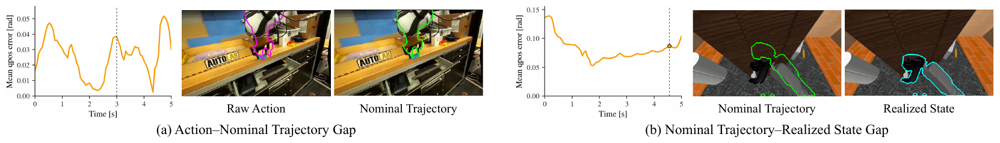
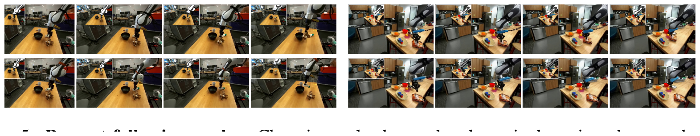
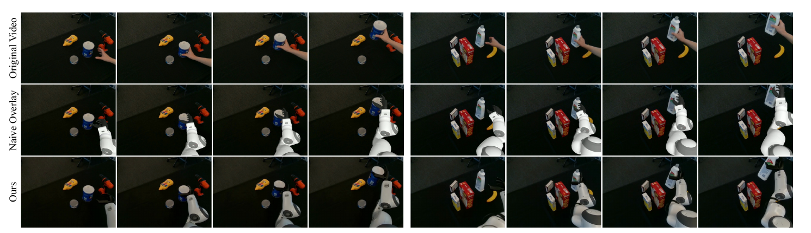

<!-- TL;DR -->
<div class="tldr">
  <b>TL;DR:</b> We factor <b>action realization</b> and <b>robot appearance</b> out of the
  world model, presenting actions as <b>visible robot geometry</b> and leaving the model to
  learn how the scene responds.
</div>

<!-- Teaser -->
<div class="video-placeholder">
  <i class="fas fa-play-circle"></i>
  <span>Teaser video</span>
  <small>drop <code>static/videos/teaser.mp4</code> here</small>
</div>

<!-- Abstract -->
<div class="columns is-centered has-text-centered">
  <div class="column is-four-fifths">
    <h2>Abstract</h2>
    <div class="content has-text-justified">
Action-conditioned video world models predict future observations from an initial observation and an action signal. In robotics, actions influence future observations through two distinct processes: they are first realized into robot motion by the robot body and controller, and the scene subsequently responds through contact outcomes and object motion. Conditioning directly on action commands asks the world model to learn the realization process itself, while conditioning on logged future states leaks the interaction outcomes it is meant to predict. We propose <b>robot-factored world models</b>, which move two robot-specific factors outside the world model. <b>First, action realization:</b> each command is rolled through the robot's own controller and kinematics into a deployment-available <i>nominal trajectory</i>. This middle signal avoids both robot-specific action-realization learning and future-state leakage. <b>Second, robot rendering:</b> this nominal trajectory is rendered through the robot URDF, factoring the robot's geometry, kinematics, and appearance out of the model and into explicit rendered robot geometry. To resolve depth ambiguity in the rendered interface, we further pair end-effector depth with scene depth, providing geometric cues for contact and occlusion beyond image-plane overlap. Together, camera-aware static RGB/depth context and rendered robot geometry form a shared visual world-model interface that remains consistent across viewpoints and robot embodiments. On DROID and RoboCasa-GR1, the rendered interface outperforms vector-conditioned baselines. We further demonstrate that the same rendered interface supports unseen robot embodiments at inference, and, as a downstream application, generate robot-interaction videos from retargeted human demonstrations.
    </div>
  </div>
</div>

---

## Method Overview

<figure class="fig">
  
  <figcaption>
    <b>Visual world-model interface.</b> Static context carries scene and viewpoint;
    rendered nominal robot geometry carries action; the diffusion model predicts the scene response.
  </figcaption>
</figure>

Instead of conditioning the world model on raw action commands, we factor out two robot-specific steps as fixed preprocessing. First, each action is rolled through the robot's own controller and kinematics into a **nominal trajectory** — robot-only motion before any scene interaction. Second, this trajectory is rendered through the robot URDF into camera-aligned **robot mesh RGB and end-effector depth**. Paired with a camera-aware static stream (scene appearance and depth), these become the model's entire action interface, leaving it the single shared problem of predicting how the scene responds.

<details>
<summary><strong>Formal formulation</strong></summary>

An action-conditioned robot world model predicts a future video $$\mathbf{V}_{1:F}$$ from the current observation and a proposed action sequence $$\boldsymbol{a}_{1:F}$$. The realization operator $$\Phi_R$$ maps actions into a nominal trajectory, and the rendering operator $$\Pi_R$$ projects it into camera-aligned robot mesh RGB and end-effector depth:

$$\begin{aligned}
\boldsymbol{q}_{1:F} &= \Phi_R(\boldsymbol{a}_{1:F};\boldsymbol{q}_0), \\
(\mathbf{M}^{\mathrm{rgb}}_{1:F}, \mathbf{D}^{\mathrm{eef}}_{1:F}) &= \Pi_R(\boldsymbol{q}_{1:F};\mathcal{C}_{1:F}).
\end{aligned}$$

With a camera-aware static stream supplying scene appearance $$\mathbf{B}^{\mathrm{rgb}}_{1:F}$$ and depth $$\mathbf{D}^{\mathrm{scene}}_{1:F}$$, the model learns

$$p_\theta\!\left(\mathbf{V}_{1:F} \mid \mathbf{B}^{\mathrm{rgb}}_{1:F}, \mathbf{D}^{\mathrm{scene}}_{1:F}, \mathbf{M}^{\mathrm{rgb}}_{1:F}, \mathbf{D}^{\mathrm{eef}}_{1:F}, \mathcal{T}\right),$$

where the text prompt $$\mathcal{T}$$ carries scene context only and excludes the intended action or outcome.

</details>

### Nominal Trajectory Conditioning

> **The right action signal lives between the raw command and the logged state: the controller-realized *nominal trajectory* is available at deployment, yet it does not leak scene interaction.**

<figure class="fig">
  
  <figcaption>
    <b>Action-to-state realization gaps.</b> (a) Robot-specific controllers and hardware constraints
    create a gap between raw actions and nominal trajectories. (b) Scene interaction creates a gap between
    nominal trajectories and realized states. The nominal trajectory is the deployment-available middle signal.
  </figcaption>
</figure>

<details>
<summary><strong>Why not raw actions or logged states?</strong></summary>

The mismatch between action signals decomposes into two gaps. The **action-realization gap** is the difference between the raw action and the controller-realized nominal motion; the **nominal–realized gap** is the difference between nominal robot motion and the state actually observed in a contact-rich rollout.

Conditioning on **raw actions** forces the model to additionally learn the robot-specific realization process. Conditioning on **logged future states** is visually aligned with the target video, but those states already encode contact, compliance, latency, and closed-loop corrections — i.e., they leak the interaction outcome the world model is meant to predict. Our factorization assigns the first gap to the robot-specific realization process $$\Phi_R$$ and leaves the second gap, together with object motion and occlusion, to the world model.

</details>

---

## Impact of Depth Conditioning

<section class="section results-section">
<div class="results-grid">
  <div class="result-card">
    <div class="video-placeholder"><i class="fas fa-robot"></i><small>static/videos/depth/depth_ablation_1.mp4</small></div>
    <div class="caption">Mesh-only · With depth · GT</div>
  </div>
  <div class="result-card">
    <div class="video-placeholder"><i class="fas fa-robot"></i><small>static/videos/depth/depth_ablation_2.mp4</small></div>
    <div class="caption">Mesh-only · With depth · GT</div>
  </div>
</div>
</section>

RGB mesh rendering places the robot only in the **image plane**, where overlap alone cannot tell a real touch from a robot simply passing in front of or behind an object. We pair **end-effector depth** with **scene depth** to make the model *depth-aware*, avoiding **false contact from image-plane overlap**.

---

## Results

<section class="section results-section">
<h3 class="title is-4 has-text-centered">DROID — external / fixed cameras</h3>
<div class="results-grid">
  <div class="result-card">
    <!-- <video controls muted loop playsinline preload="metadata"><source src="static/videos/droid/result_1.mp4" type="video/mp4"></video> -->
    <div class="video-placeholder"><i class="fas fa-robot"></i><small>static/videos/droid/result_1.mp4</small></div>
    <div class="caption">Static context · Rendered robot · Prediction · GT</div>
  </div>
  <div class="result-card">
    <div class="video-placeholder"><i class="fas fa-robot"></i><small>static/videos/droid/result_2.mp4</small></div>
    <div class="caption">Static context · Rendered robot · Prediction · GT</div>
  </div>
  <div class="result-card">
    <div class="video-placeholder"><i class="fas fa-robot"></i><small>static/videos/droid/result_3.mp4</small></div>
    <div class="caption">Static context · Rendered robot · Prediction · GT</div>
  </div>
  <div class="result-card">
    <div class="video-placeholder"><i class="fas fa-robot"></i><small>static/videos/droid/result_4.mp4</small></div>
    <div class="caption">Static context · Rendered robot · Prediction · GT</div>
  </div>
</div>

<h3 class="title is-4 has-text-centered">RoboCasa-GR1 — humanoid manipulation</h3>
<div class="results-grid">
  <div class="result-card">
    <div class="video-placeholder"><i class="fas fa-robot"></i><small>static/videos/robocasa/result_1.mp4</small></div>
    <div class="caption">Static context · Rendered robot · Prediction · GT</div>
  </div>
  <div class="result-card">
    <div class="video-placeholder"><i class="fas fa-robot"></i><small>static/videos/robocasa/result_2.mp4</small></div>
    <div class="caption">Static context · Rendered robot · Prediction · GT</div>
  </div>
</div>
</section>

The rendered interface gives the video model direct pixel-space evidence of robot motion, so predicted scene changes are better localized around the robot and the contact region than vector- or pose-conditioned baselines. Rendered robot geometry localizes robot-driven scene changes, while depth helps resolve contact-relevant proximity and occlusion.

---

## Prompt Following

<figure class="fig">
  
  <figcaption>
    <b>Prompt-following probe.</b> Holding the initial scene fixed and editing only the rendered nominal
    motion changes the predicted scene response — the model uses rendered robot geometry as the action signal.
  </figcaption>
</figure>

## Zero-Shot Embodiment Generalization

Since an action enters only as **rendered robot geometry**, robots never seen during training — a new arm–hand pairing, or even multiple arms — pass through the exact same interface and still drive a plausible scene response. This is nontrivial for vector- or pose-conditioned models, where a new embodiment brings a different action space and a new action-to-motion mapping to learn. Each clip shows **Mesh rendering (input)  ·  Ours (generated)  ·  GT**.

<section class="embod">

  <p class="embod-note">Beyond the rendered mesh shown here, the model also conditions on scene depth and end-effector depth; both are omitted from these strips for space.</p>

  <!-- ===== Group 1: unseen arm + hand composition (HRDexDB) ===== -->
  <div class="embod-group-title">Unseen Composition — Robot Arm + Dexterous Hand</div>
  <p class="embod-group-sub">An xArm 6 arm paired with an Inspire F1 hand — a combination never seen together in training. Evaluated on <a href="https://snuvclab.github.io/HRDexDB/" target="_blank">HRDexDB</a>.</p>

  <div class="embod-example">
    <div class="strip-labels"><span>Mesh rendering</span><span>Ours</span><span>GT</span></div>
    <video controls autoplay muted loop playsinline preload="metadata"
           poster="static/videos/embodiment/hrdex_apple.jpg">
      <source src="static/videos/embodiment/hrdex_apple.mp4" type="video/mp4">
    </video>
  </div>

  <div class="embod-example">
    <div class="strip-labels"><span>Mesh rendering</span><span>Ours</span><span>GT</span></div>
    <video controls autoplay muted loop playsinline preload="metadata"
           poster="static/videos/embodiment/hrdex_banana.jpg">
      <source src="static/videos/embodiment/hrdex_banana.mp4" type="video/mp4">
    </video>
  </div>

  <!-- ===== Group 2: multiple arms (DexMimicGen) ===== -->
  <div class="embod-group-title">Multiple Robot Arms — Dual Robot Arms</div>
  <p class="embod-group-sub">Two robot arms composed into a single scene — a robot count outside the single-arm training setup. Evaluated on <a href="https://dexmimicgen.github.io/" target="_blank">DexMimicGen</a>.</p>

  <div class="embod-example">
    <div class="strip-labels"><span>Mesh rendering</span><span>Ours</span><span>GT</span></div>
    <video controls autoplay muted loop playsinline preload="metadata"
           poster="static/videos/embodiment/dexmimicgen_dual.jpg">
      <source src="static/videos/embodiment/dexmimicgen_dual.mp4" type="video/mp4">
    </video>
  </div>

</section>

## Application: Human Demonstration → Robot Video

<figure class="fig">
  
  <figcaption>
    <b>Human demonstration to robot video.</b> Human manipulation videos (DexYCB) are retargeted to a robot
    and rendered as the same mesh-and-depth interface, then converted into a robot-interaction rollout —
    the world model consumes rendered robot geometry regardless of the motion source.
  </figcaption>
</figure>

<div class="video-placeholder">
  <i class="fas fa-play-circle"></i>
  <span>Human-to-robot rollouts</span>
  <small>drop <code>static/videos/human2robot.mp4</code> here</small>
</div>

---

## BibTeX

```bibtex
@article{kim2026rofacto,
  title   = {Robot-Factored World Models via Robot Rendering},
  author  = {Kim, Byungjun and Kim, Taeksoo and Cha, Hyunsoo and Joo, Hanbyul},
  journal = {arXiv preprint},
  year    = {2026}
}
```
